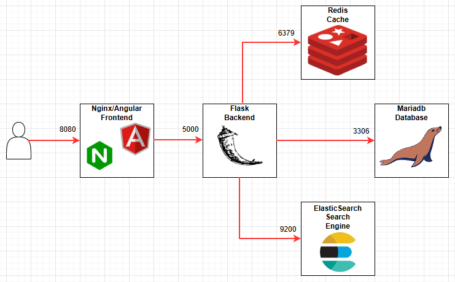
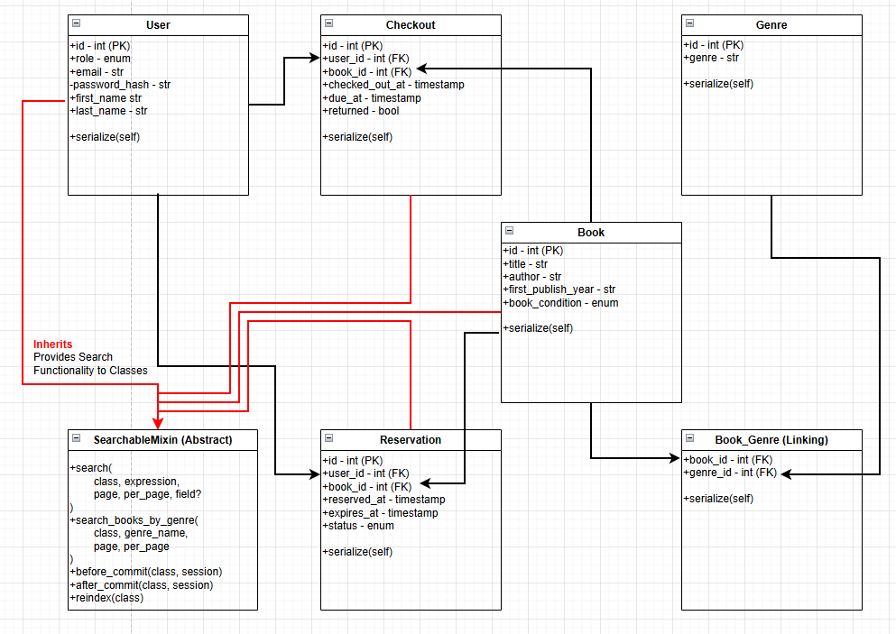

# Design Documentation
## Application Stack Architecture

### Components

#### Frontend Container
- **Tools/Frameworks:** Angular (TypeScript), Nginx
- **Description:** An end user facing Single Page Application (SPA), written in Angular, and served with Nginx.
- **Responsibilities:**
    - Serve static files of the Angular application.
    - Handle client-side routing in the browser without full-page reloads.
    - Validates input and makes HTTP API requests to the Flask backend for data retrieval and processing on the end user's behalf.

#### Backend Container
- **Tools/Frameworks:** Flask (Python)
- **Description:** As the core of the Arbor Library Web Application, the Flask server answers API requests from the frontend, performs business logic with those requests, and enables all other components of the application stack.
- **Responsibilities:**
    - Listens for HTTP API requests from the frontend and returns for rendering.
    - Validates input, manages business logic, enables authentication, and processes data.
    - Interacts with the database for data storage and retrieval.
    - Interacts with the search engine to provide a word search.
    - Interacts with Redis for JWT token revocation storage and queries.

#### Database Container
- **Tools/Frameworks:** MariaDB
- **Description:** Relational database management system for persistant storage of structured data.
- **Responsibilities:**
    - CRUD operations on structured data tables.
    
**Class Diagram:**

#### Search Engine Container
- **Tools/Frameworks:** ElasticSearch
- **Description:** Used for word search and the indexing of select database tables. Provides fast and scalable search functionality.
- **Responsibilities:**
    - Index large datasets for efficient search and retrieval.
    - Offloads search queries from the database.

#### Cache Container
- **Tools/Frameworks:** Redis
- **Description:** An in-memory cache to store quickly store and provide frequently accessed data.
- **Responsibilties:**
    - Quickly stores and provides revoked JSON Web Tokens to the backend, used in authentication.
    - Offloads read/write operations from the database.

