# User Guide
- [Patron Guide](#patron-guide)
- [Librarian Guide](#librarian-guide)

# Patron Guide

## Sign Up
- Click **"Sign Up"** button.

  

    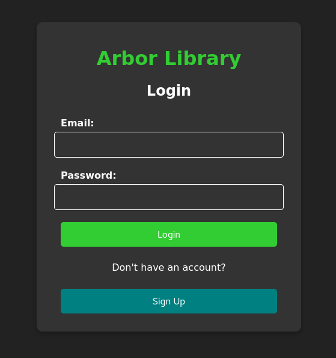
  

   

- Input email, password, password confirmation, first name, and last name. Click **"Submit"**.

  

    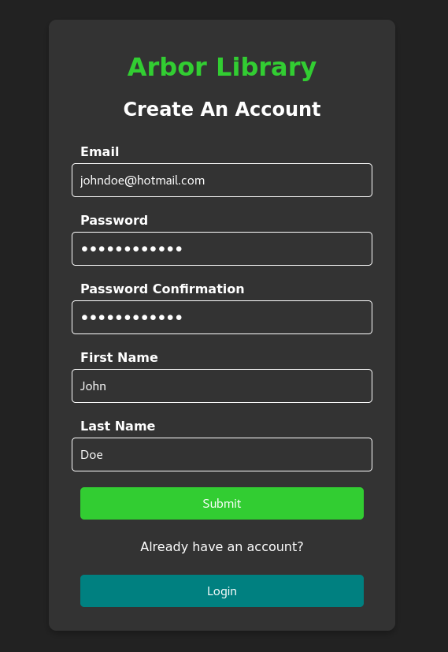
  

   

- Return to the previous page, or click **"Login"** to log in.

  

    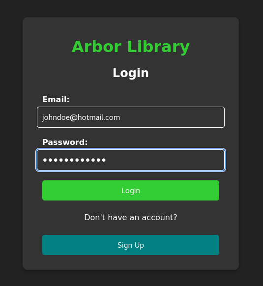
  

   

## Home Page
- After logging in, you will be greeted with this page.

  

    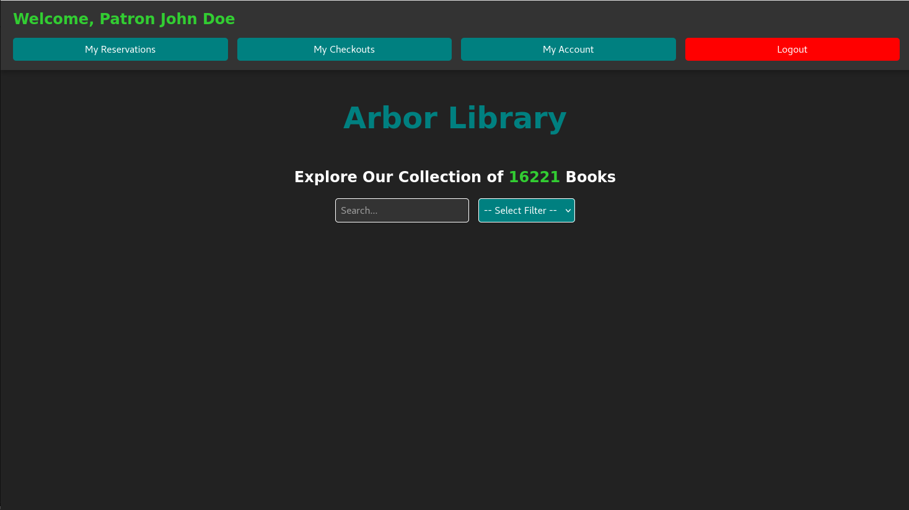
  

   

- Here, you can search for books using the provided search bar and an optional filter.

  

    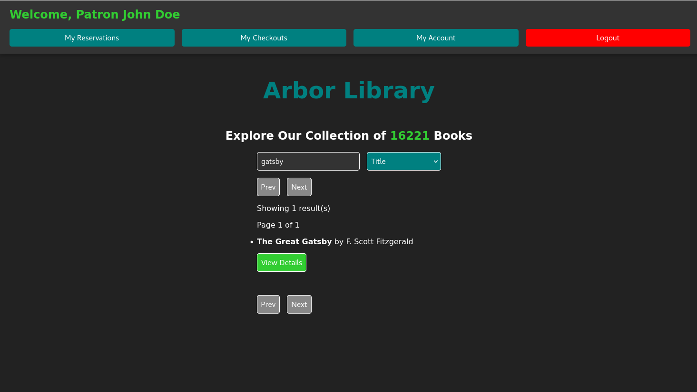
  

   

- Click the **"View Details"** button under a search result to view more details, and **"Reserve Now!"** to reserve the title to check out later in person.

  

    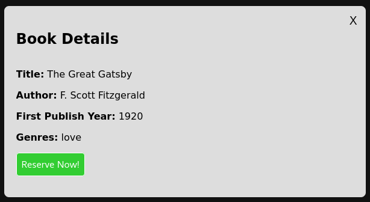
  

   

- On the home page navbar:
    - To view/cancel your reservations, click **"My Reservations"**
    - To view your checked out books, click **"My Checkouts"**
    - To view, edit, or delete your account, click **"My Account"**
  

    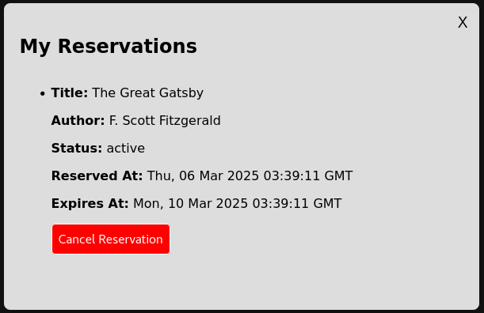
  

   
  

    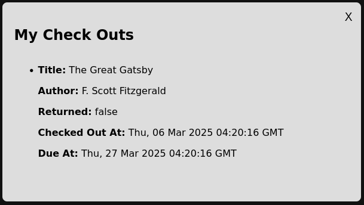
  

   
  

    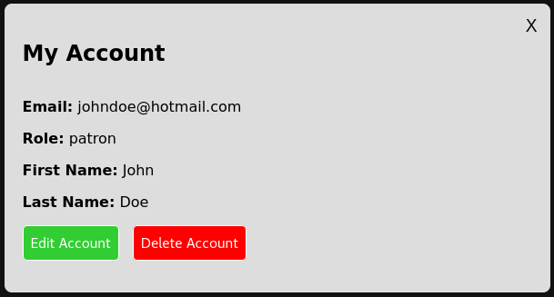
  

   

# Librarian Guide
**NOTE:** A user with the Librarian Role can do everything that a patron can do. (edit/delete account, make reservations etc.)

## Librarian Dashboard
- Librarians have an extra button on their home page navbar: **Librarian Dashboard**

  

    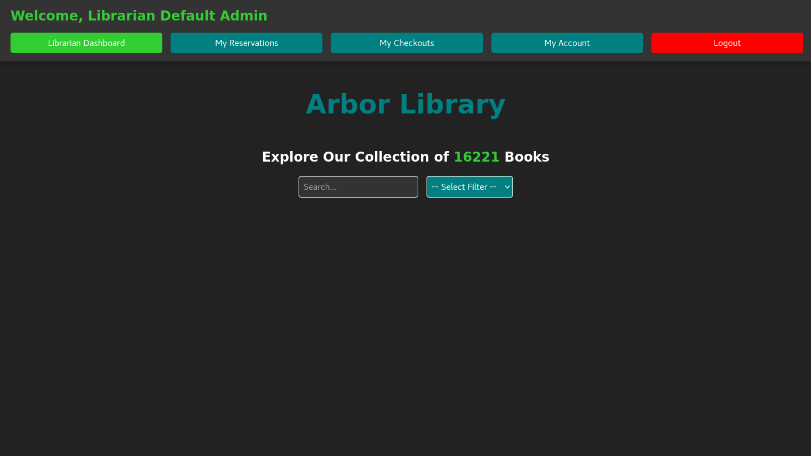
  

   

- Within the Librian Dashboard, Librarians can do the following:

### Check In Books
- Check in a book by searching for a user, or a book with the provided search bar and optional filter selection.

  

    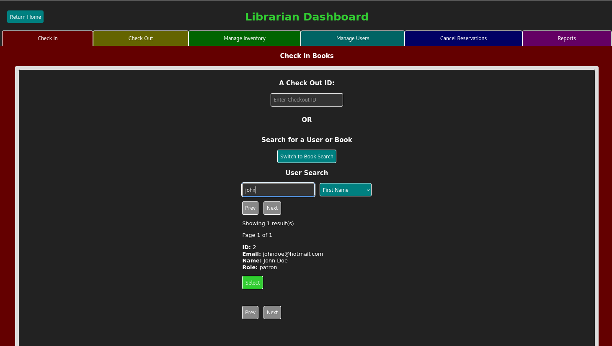
  

   

- Once the correct user or book is selected in the search results, the application will find all active (unreturned) check out records for the user/book.

  

    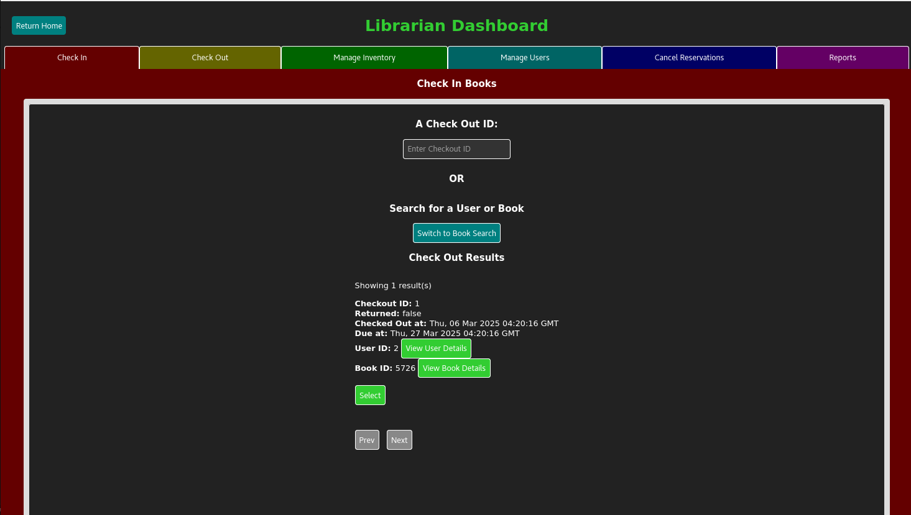
  

   

- To learn more about the specific user or book returned in the check out results, select **View User Details** or **View Book Details**.

  

    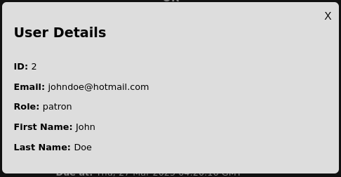
  

   
  

    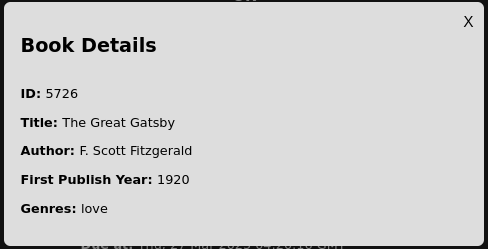
  

   

- after a specific check out record is selected, simply click the **Check In** button.

**NOTE:** Librarian's may also simply enter the _Checkout ID_, if on hand, and click the **Check In** button to accomplish the same task as above.

### Check Out Books
- Check out a book out by entering a _User ID_ and _Book ID_, or by searching for a User and a Book to select them.

  

    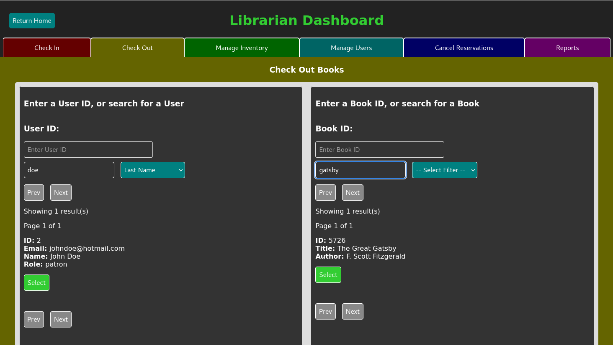
  

   

- Once both the _User ID_ and _Book ID_ fields have input, a **Check Out** button appears to complete the transaction.

### Manage Inventory
- Manage your inventory of books by adding books or genres, editing books, and deleting books.

- To find a book, search for it with the provided search bar and optional filter selection.

  

    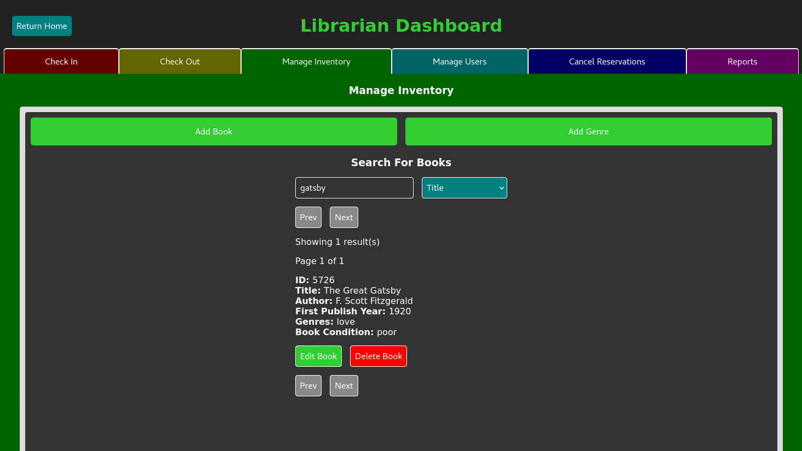
  

   

- Click **Edit Book** to change a book's title, author, first year published, and condition.

  

    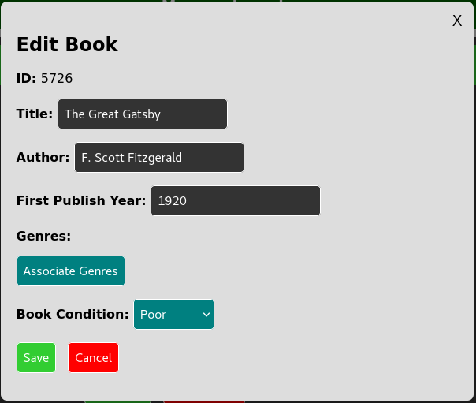
  

   

- On the Edit Book menu, you can also associate genres to the book by selecting **Associate Genres**. When finished, click **Save Genres**.

  

    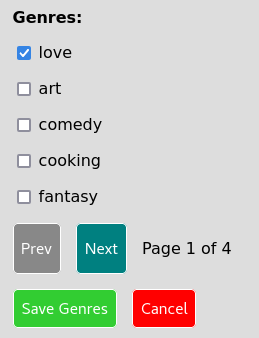
  

   

- To add a new book, click **Add Book**. To add a new genre, click **Add Genre**

  

    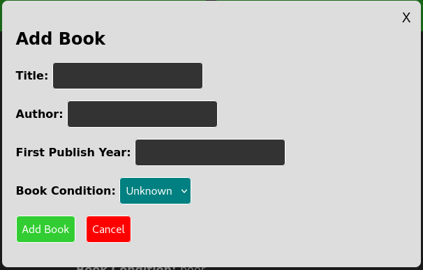
  

   
    

    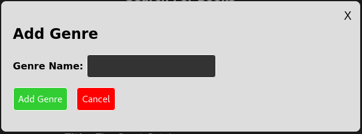
  

   

### Manage Users
- On the Manage Users page, a Librarian can switch a role of a user (Librarian -> Patron, and Patron -> Librarian) by selecting the **Switch Role** button.
- Librarians can also also delete users by selecting the **Delete User** button.

- Simply search for a user with the provided search bar and optional filter selection until the desired user is within the results.

  

    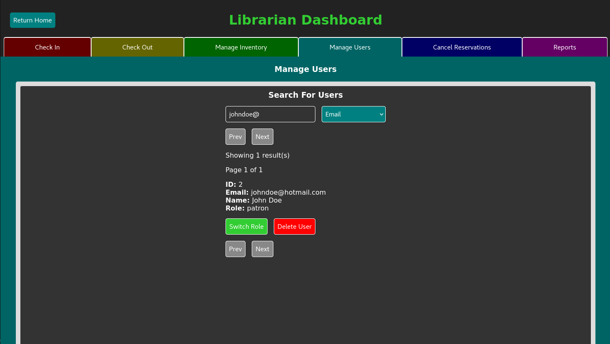
  

   

### Cancel Reservations
- Cancel a user's reservation by searching for a user or book with the provided search bar and optional filter selection.

  

    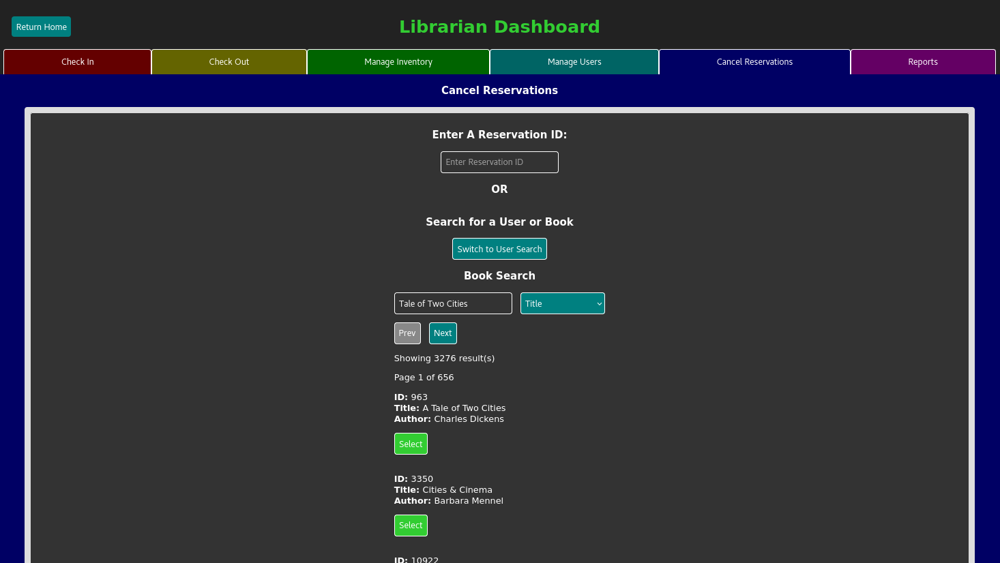
  

   

- Once the correct user or book is displayed in the search results, the application will find all active reservation records for the user/book.

  

    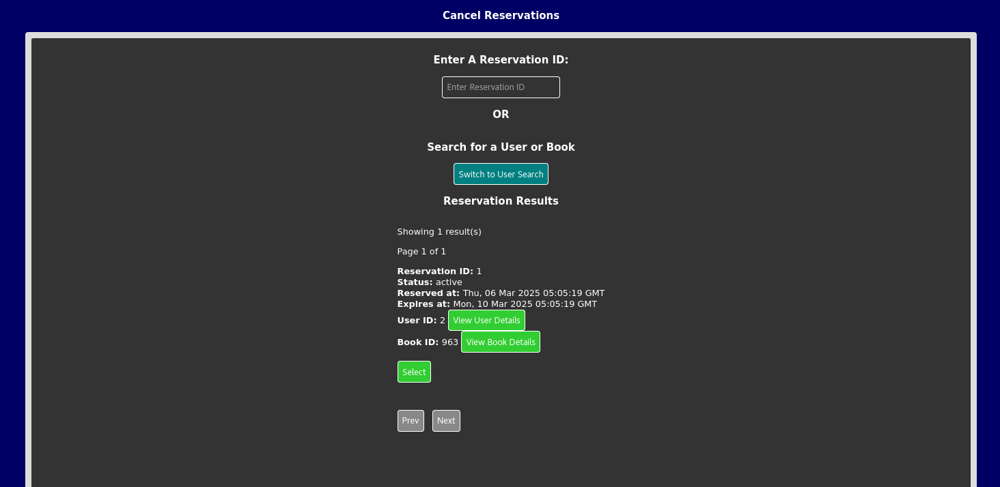
  

   

- To learn more about the specific user or book returned in the reservation results, select **View User Details** or **View Book Details**.

  

    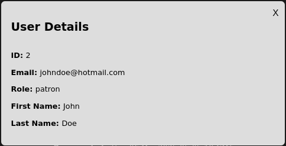
  

   
  

    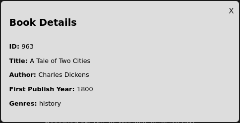
  

   

- after a specific reservation record is selected, simply click the **Cancel Reservation** button.

**NOTE:** Librarian's may also simply enter the _Reservation ID_, if on hand, and click the **Cancel Reservation** button to accomplish the same task as above.

### Generate Reports
